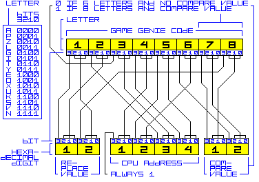

# nesgenie

Encodes and decodes codes for the [Nintendo Entertainment System](http://en.wikipedia.org/wiki/Nintendo_Entertainment_System) (NES) cheat cartridge [Game Genie](http://en.wikipedia.org/wiki/Game_Genie).

Developed with Python 3 under 64-bit Windows.

## The structure of Game Genie codes
* The codes consist of the following 16 letters (in alphabetical order): **`A E G I K L N O P S T U V X Y Z`**.
* There are two types of codes: **six-letter** and **eight-letter**.
* In canonical codes, the **third letter** reflects the length of the code:
  * In **six-letter** codes, the letter is one of **`A G I L P T Y Z`** (e.g. `SXIOPO`).
  * In **eight-letter** codes, the letter is one of **`E K N O S U V X`** (e.g. `YEUZUGAA`).

## The structure of unencoded codes
  * **`AAAA:RR`** corresponds to a **six-letter** Game Genie code.
  * **`AAAA?CC:RR`** corresponds to an **eight-letter** Game Genie code.

What the fields mean:
  * **`AAAA`**: the CPU **address** in hexadecimal (`8000`&ndash;`ffff`)
  * **`CC`**: the **compare** value in hexadecimal (`00`&ndash;`ff`)
  * **`RR`**: the **replacement** value in hexadecimal (`00`&ndash;`ff`)
  * **`?`**: a question mark
  * **`:`**: a colon

## How to decode a code
The command line argument is a Game Genie code as described in the chapter *The structure of Game Genie codes*, with the following exceptions:
  * **Non-canonical** codes are also accepted.
  * The codes are **case insensitive**.

The program will output:
  * the Game Genie code in its canonical form
  * the decoded code

## How to encode a code
The command line argument is an unencoded code as described in the chapter *The structure of unencoded codes*, with the following exceptions:
  * As for the CPU address, `0000` will be accepted instead of `8000`, `0001` instead of `8001`, etc.
  * The hexadecimal values are **case insensitive**.

The output:
  * the unencoded code in its canonical form
  * the Game Genie code

## Examples

**Decode** a **six-letter** code:
```
python nesgenie.py sxiopo
SXIOPO = 91d9:ad
```

**Decode** an **eight-letter** code:
```
python nesgenie.py yeuzugaa
YEUZUGAA = acb3?00:07
```

**Encode** a **six-letter** code:
```
python nesgenie.py 91d9:ad
91d9:ad = SXIOPO
```

**Encode** an **eight-letter** code:
```
python nesgenie.py acb3?00:07
acb3?00:07 = YEUZUGAA
```

## A diagram
*Note*: there's an error in the diagram; I'll fix it later.



## References
* [*NES Game Genie Code Format DOC v0.71 by Benzene of Digital Emutations*](http://nesdev.com/nesgg.txt)
