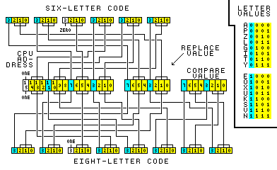

# nes-util
Various utilities related to the [Nintendo Entertainment System](http://en.wikipedia.org/wiki/Nintendo_Entertainment_System).

**Note**: many programs in this repo require the [Pillow](https://python-pillow.org) module and qneslib.py (immediately below).

## qneslib.py
Does not do anything by itself but is needed by many other programs in this repo. Just copy this file to the same directory. Formerly known as neslib.py, ineslib.py and nesgenielib.py.
```
NAME
    qneslib - qalle's NES library (Nintendo Entertainment System stuff).

FUNCTIONS
    cpu_address_to_prg_addresses(handle, cpuAddr, comp=None)
        Generate PRG ROM addresses that may correspond to the CPU address.
        handle: valid iNES file
        cpuAddr: CPU address (0x8000...0xffff)
        comp: compare value (0x00...0xff or None)

    game_genie_decode(code)
        Decode a Game Genie code.
        code: 6 or 8 letters from GAME_GENIE_LETTERS
        return:
            if invalid  code: None
            if 6-letter code: (CPU_address, replacement_value, None)
            if 8-letter code: (CPU_address, replacement_value, compare_value)

    game_genie_encode(addr, repl, comp=None)
        Encode a Game Genie code.
        addr: CPU address (0...0xffff; MSB ignored)
        repl: replacement value (0...0xff)
        comp: compare value (0...0xff or None)
        return:
            if invalid arguments  : None
            if compare is None    : 6-letter code
            if compare is not None: 8-letter code

    ines_header_decode(handle)
        Parse the header from an iNES ROM file. Return a dict or None on error.

    ines_header_encode(prgSize, chrSize, mapper=0, mirroring='h', saveRam=False)
        Return a 16-byte iNES header.
        prgSize: PRG ROM size
        chrSize: CHR ROM size
        mapper: iNES mapper number
        mirroring: name table mirroring ('h'/'v'/'f')
        saveRam: does the game have save RAM

    is_prg_bankswitched(prgSize, mapper)
        Does the game use PRG ROM bankswitching? (May give false positives.)
        prgSize: PRG ROM size, mapper: iNES mapper number

    min_prg_bank_size(prgSize, mapper)
        Get the smallest possible PRG ROM bank size the game may use (8/16/32 KiB).
        The result may be too small.
        prgSize: PRG ROM size, mapper: iNES mapper number

    min_prg_bank_size_for_mapper(mapper)
        Get the smallest PRG ROM bank size supported by the iNES mapper number
        (8/16/32 KiB; 8 KiB if unknown).

    prg_address_to_cpu_addresses(prgAddr, prgBankSize)
        Generate CPU ROM addresses (0x8000...0xffff) from PRG ROM address.
        prgBankSize: PRG ROM bank size (8/16/32 KiB)

    tile_slice_decode(loByte, hiByte)
        Decode 8*1 pixels of one tile.
        loByte, hiByte: low/high bitplane (8 bits each)
        return: eight 2-bit big-endian ints

    tile_slice_encode(pixels)
        Encode 8*1 pixels of one tile.
        pixels: eight 2-bit big-endian ints
        return: 8-bit ints: (low_bitplane, high_bitplane)

DATA
    GAME_GENIE_LETTERS = 'APZLGITYEOXUKSVN'
    PALETTE = {0: (116, 116, 116), 1: (36, 24, 140), 2: (0, 0, 168), 3: (6...
```



## ines_combine.py
```
usage: ines_combine.py [-h] -p PRG_ROM [-c CHR_ROM] [-m MAPPER] [-n {h,v,f}]
                       [-s]
                       outputFile

Create an iNES ROM file (.nes) from PRG ROM and CHR ROM data files.

positional arguments:
  outputFile            The iNES ROM file (.nes) to write.

optional arguments:
  -h, --help            show this help message and exit
  -p PRG_ROM, --prg-rom PRG_ROM
                        PRG ROM data file. Required. Size: 16...4096 KiB and a
                        multiple of 16 KiB.
  -c CHR_ROM, --chr-rom CHR_ROM
                        CHR ROM data file. Optional. Size: 0...2040 KiB and a
                        multiple of 8 KiB.
  -m MAPPER, --mapper MAPPER
                        Mapper number (0...255). Default=0 (NROM).
  -n {h,v,f}, --mirroring {h,v,f}
                        Type of name table mirroring: h=horizontal (default),
                        v=vertical, f=four-screen.
  -s, --save-ram        The game contains battery-backed PRG RAM at
                        $6000...$7fff.
```

## ines_info.py
Print information of an iNES ROM file (.nes) in CSV format. Argument: file. Output fields: "file","size","PRG ROM size","CHR ROM size","mapper","name table mirroring","has save RAM?","trainer size","file CRC32","PRG ROM CRC32","CHR ROM CRC32"

Example:
```
"smb1.nes",40976,32768,8192,0,"vertical","no",0,"3337ec46","5cf548d3","867b51ad"
```

## ines_split.py
```
usage: ines_split.py [-h] [-p PRG] [-c CHR] input_file

Extract PRG ROM and/or CHR ROM data from an iNES ROM file (.nes). Specify at
least one output file.

positional arguments:
  input_file         iNES ROM file (.nes) to read.

optional arguments:
  -h, --help         show this help message and exit
  -p PRG, --prg PRG  File to write PRG ROM data to.
  -c CHR, --chr CHR  File to write CHR ROM data to. Not written if there is no
                     data.
```

## nes_blaster_mapext.py
```
usage: nes_blaster_mapext.py [-h] [-j] [-n MAP_NUMBER]
                             [-u ULTRA_SUBBLOCK_IMAGE] [-s SUBBLOCK_IMAGE]
                             [-b BLOCK_IMAGE] [-m MAP_IMAGE] [-v]
                             input_file

Extract world maps from NES Blaster Master to PNG files. Notes: specify at
least one of -u/-s/-b/-m; all addresses printed are hexadecimal.

positional arguments:
  input_file            Blaster Master ROM file in iNES format (.nes, US/US
                        prototype/EUR/JP; see also --japan).

optional arguments:
  -h, --help            show this help message and exit
  -j, --japan           Input file is Japanese version (Chou-Wakusei Senki -
                        MetaFight).
  -n MAP_NUMBER, --map-number MAP_NUMBER
                        Map to extract: 0...7 = side view of area 1...8,
                        8...15 = overhead view of area 1...8. Default=0.
  -u ULTRA_SUBBLOCK_IMAGE, --ultra-subblock-image ULTRA_SUBBLOCK_IMAGE
                        Save ultra-subblocks as PNG file (256*256 px).
  -s SUBBLOCK_IMAGE, --subblock-image SUBBLOCK_IMAGE
                        Save subblocks as PNG file (512*512 px).
  -b BLOCK_IMAGE, --block-image BLOCK_IMAGE
                        Save blocks as PNG file (1024*1024 px).
  -m MAP_IMAGE, --map-image MAP_IMAGE
                        Save map as PNG file (up to 2048*2048 px). You
                        probably want this.
  -v, --verbose         Print more information.
```

## nes_chr_decode.py
```
usage: nes_chr_decode.py [-h] [-p PALETTE PALETTE PALETTE PALETTE]
                         input_file output_file

Convert NES CHR (graphics) data into a PNG file.

positional arguments:
  input_file            File to read. An iNES ROM file (extension '.nes') or
                        raw CHR data (any other extension; size must be a
                        multiple of 256 bytes).
  output_file           PNG file to write. Always 128 pixels (16 tiles) wide.

optional arguments:
  -h, --help            show this help message and exit
  -p PALETTE PALETTE PALETTE PALETTE, --palette PALETTE PALETTE PALETTE PALETTE
                        Output palette (which colors correspond to CHR colors
                        0...3). Four color codes (hexadecimal RGB or RRGGBB)
                        separated by spaces. Default: '000 555 aaa fff'
```

## nes_chr_encode.py
```
usage: nes_chr_encode.py [-h] [-p PALETTE PALETTE PALETTE PALETTE]
                         input_file output_file

Convert an image file into an NES CHR (graphics) data file.

positional arguments:
  input_file            The image file to read (e.g. PNG). The width must be
                        128 pixels. The height must be a multiple of 8 pixels.
                        There must be four unique colors or less. --palette
                        must contain all the colors in the image, but the
                        image need not contain all the colors in --palette.
  output_file           The NES CHR data file to write. The size will be a
                        multiple of 256 bytes.

optional arguments:
  -h, --help            show this help message and exit
  -p PALETTE PALETTE PALETTE PALETTE, --palette PALETTE PALETTE PALETTE PALETTE
                        PNG palette (which colors correspond to CHR colors
                        0...3). Four color codes (hexadecimal RGB or RRGGBB)
                        separated by spaces. Must be all distinct. Default:
                        '000000 555555 aaaaaa ffffff'
```

## nes_color_swap.py
```
usage: nes_color_swap.py [-h] [-c {0,1,2,3} {0,1,2,3} {0,1,2,3} {0,1,2,3}]
                         [-f FIRST_TILE] [-n TILE_COUNT]
                         input_file output_file

Swap colors in the graphics data (CHR ROM) of an iNES ROM file (.nes).

positional arguments:
  input_file            iNES ROM file (.nes) to read.
  output_file           iNES ROM file (.nes) to write.

optional arguments:
  -h, --help            show this help message and exit
  -c {0,1,2,3} {0,1,2,3} {0,1,2,3} {0,1,2,3}, --colors {0,1,2,3} {0,1,2,3} {0,1,2,3} {0,1,2,3}
                        Change original colors 0...3 to these colors. Four
                        colors (each 0...3) separated by spaces. Default: 0 2
                        3 1
  -f FIRST_TILE, --first-tile FIRST_TILE
                        First tile to change (0 or greater, default=0).
  -n TILE_COUNT, --tile-count TILE_COUNT
                        Number of tiles to change. 0 (default) = all starting
                        from --first-tile.
```

## nes_cpuaddr.py
Convert an NES PRG ROM address into possible CPU addresses using the iNES ROM file (.nes). Args: file address_in_hexadecimal

## nesgenie.py
Encode and decode NES Game Genie codes. Argument: six-letter code, eight-letter code, AAAA RR or AAAA RR CC (AAAA = address in hexadecimal, RR = replacement value in hexadecimal, CC = compare value in hexadecimal).

## nesgenie_6to8.py
Convert a 6-letter NES Game Genie code into 8 letters using the iNES ROM file (.nes). Args: file code

## nesgenie_prgaddr.py
Find the PRG ROM addresses affected by an NES Game Genie code in an iNES ROM file (.nes). Args: file code

## nesgenie_verconv.py
```
usage: nesgenie_verconv.py [-h] [-s SLICE_LENGTH] [-d MAX_DIFFERENT_BYTES]
                           [-v]
                           code file1 file2

Read two versions (e.g. Japanese and US) of the same NES game in iNES format
(.nes) and a Game Genie code for one of the versions. Output the equivalent
code for the other version of the game. Technical explanation: decode the
code; find out PRG ROM addresses affected in file1; see what's in and around
them; look for similar bytestrings in file2's PRG ROM; convert the addresses
back into CPU addresses; encode them into codes.

positional arguments:
  code                  An NES Game Genie code that is known to work with
                        file1. Six-letter codes are not allowed if file1 uses
                        PRG ROM bankswitching.
  file1                 An iNES ROM file (.nes) to read. The game your code is
                        known to work with.
  file2                 Another iNES ROM file (.nes) to read. The equivalent
                        code for this game will be searched for.

optional arguments:
  -h, --help            show this help message and exit
  -s SLICE_LENGTH, --slice-length SLICE_LENGTH
                        How many PRG ROM bytes to compare both before and
                        after the relevant byte (that is, total number of
                        bytes compared is twice this value, plus one). Fewer
                        bytes will be compared if the relevant byte is too
                        close to start or end of PRG ROM.) 1 to 20, default=4.
                        Decrease to get more results.
  -d MAX_DIFFERENT_BYTES, --max-different-bytes MAX_DIFFERENT_BYTES
                        Maximum number of non-matching bytes allowed in each
                        pair of PRG ROM slices to compare. (The relevant byte
                        must always match.) Minimum=0, default=1,
                        maximum=twice --slice-length, minus one. Increase to
                        get more results.
  -v, --verbose         Print more information. Note: all printed numbers are
                        hexadecimal.
```

## nes.asm
NES assembly routines for [asm6f](https://github.com/freem/asm6f). Used by many of my projects.
