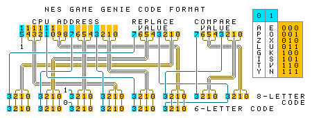

# nes-util
Various utilities related to the [Nintendo Entertainment System](http://en.wikipedia.org/wiki/Nintendo_Entertainment_System).

## Libraries
You need these to run some of the other programs in this repo.

### neslib.py
```
NAME
    neslib - A library for miscellaneous NES (Nintendo Entertainment System) stuff.

FUNCTIONS
    CPU_address_to_PRG_addresses(handle, CPUAddr, compareValue=None)
        Generate PRG ROM addresses that may correspond to the CPU address.
        handle: handle of a valid iNES file (.nes)
        CPUAddr: CPU ROM address (0x8000-0xffff)
        compareValue: 0x00-0xff or None

    PRG_address_to_CPU_addresses(fileInfo, PRGAddr)
        Generate CPU ROM addresses (0x8000-0xffff) from the PRG ROM address.
        fileInfo: from ineslib.parse_iNES_header()
        PRGAddr: PRG ROM address

    decode_tile(data)
        Decode an NES tile (planar to interleaved).
        data: 16 bytes
        return: pixels as 64 2-bit big-endian integers

    decode_tile_slice(LSBs, MSBs)
        Decode 8*1 pixels of one tile (planar to interleaved).
        LSBs: the least significant bits (8-bit int)
        MSBs: the most significant bits (8-bit int)
        return: pixels (iterable, 8 2-bit big-endian ints)

    encode_tile_slice(tileSlice)
        Encode 8*1 pixels of one tile (interleaved to planar).
        tileSlice: pixels (8 2-bit big-endian ints)
        return: (8-bit int least_significant_bits, 8-bit int most_significant_bits)

DATA
    PALETTE = {0: (116, 116, 116), 1: (36, 24, 140), 2: (0, 0, 168), 3: (6...
```

### ineslib.py
```
DESCRIPTION
    A library for parsing/encoding iNES ROM files (.nes).
    See http://wiki.nesdev.com/w/index.php/INES

CLASSES
    builtins.Exception(builtins.BaseException)
        iNESError

FUNCTIONS
    create_iNES_header(PRGSize, CHRSize, mapper=0, mirroring='h', saveRAM=False)
        Return a 16-byte iNES header as bytes. On error, raise an exception with an error message.
        PRGSize: PRG ROM size (16 * 1024 to 4096 * 1024 and a multiple of 16 * 1024)
        CHRSize: CHR ROM size (0 to 2040 * 1024 and a multiple of 8 * 1024)
        mapper: mapper number (0-255)
        mirroring: name table mirroring ('h'=horizontal, 'v'=vertical, 'f'=four-screen)
        saveRAM: does the game have save RAM

    get_PRG_bank_size(fileInfo)
        Get PRG ROM bank size of an iNES file. (The result may be too small.)
        fileInfo: from parse_iNES_header()
        return: bank size in bytes (8/16/32 KiB)

    get_mapper_PRG_bank_size(mapper)
        Get the smallest PRG ROM bank size the mapper supports (8 KiB for unknown mappers).
        mapper: iNES mapper number (0-255)
        return: bank size in bytes (8/16/32 KiB)

    is_PRG_bankswitched(fileInfo)
        Does the iNES file use PRG ROM bankswitching? (May give false positives.)
        fileInfo: from parse_iNES_header()

    parse_iNES_header(handle)
        Parse an iNES header. Return a dict. On error, raise an exception with an error message.
```

### nesgenielib.py
```
DESCRIPTION
    A library for decoding and encoding NES Game Genie codes.
    See http://nesdev.com/nesgg.txt

CLASSES
    builtins.Exception(builtins.BaseException)
        NESGenieError

FUNCTIONS
    decode_code(code)
        Decode a Game Genie code.
        code: 6 or 8 letters from GENIE_LETTERS, case insensitive
        return: (address, replacement_value, compare_value/None)
        on error: raise NESGenieError

    encode_code(address, replacement, compare=None)
        Encode a Game Genie code.
        address: NES CPU address (0x8000-0xffff or equivalently 0x0000-0x7fff)
        replacement: replacement value (0x00-0xff)
        compare: compare value (int, 0x00-0xff) or None
        return:
            if compare is None: a 6-letter code (str)
            if compare is not None: an 8-letter code (str)
        on error: raise NESGenieError

    is_valid_code(code)
        Validate a Game Genie code case-insensitively. Return True if valid, False if invalid.

DATA
    GENIE_LETTERS = 'APZLGITYEOXUKSVN'
```



## Other Python programs
Some of these require the libraries above or the [Pillow](https://python-pillow.org) module.

### ines_combine.py
```
usage: ines_combine.py [-h] -p PRG_ROM [-c CHR_ROM] [-m MAPPER] [-n {h,v,f}]
                       [-s]
                       outputFile

Create an iNES ROM file (.nes) from PRG ROM and CHR ROM data files.

positional arguments:
  outputFile            The iNES ROM file (.nes) to write.

optional arguments:
  -h, --help            show this help message and exit
  -p PRG_ROM, --prg-rom PRG_ROM
                        PRG ROM data file. Required. Size: 16...4096 KiB and a
                        multiple of 16 KiB.
  -c CHR_ROM, --chr-rom CHR_ROM
                        CHR ROM data file. Optional. Size: 0...2040 KiB and a
                        multiple of 8 KiB.
  -m MAPPER, --mapper MAPPER
                        Mapper number (0...255). Default=0 (NROM).
  -n {h,v,f}, --mirroring {h,v,f}
                        Type of name table mirroring: h=horizontal (default),
                        v=vertical, f=four-screen.
  -s, --save-ram        The game contains battery-backed PRG RAM at
                        $6000...$7fff.
```

### ines_info.py
Print information of an iNES ROM file (.nes) in CSV format. Argument: file. Output fields: "file","size","PRG ROM size","CHR ROM size","mapper","name table mirroring","has save RAM?","trainer size","file CRC32","PRG ROM CRC32","CHR ROM CRC32"

Example:
```
"smb1.nes",40976,32768,8192,0,"vertical","no",0,"3337ec46","5cf548d3","867b51ad"
```

### ines_split.py
```
usage: ines_split.py [-h] [-p PRG] [-c CHR] input_file

Extract PRG ROM and/or CHR ROM data from an iNES ROM file (.nes). Specify at
least one output file.

positional arguments:
  input_file         iNES ROM file (.nes) to read.

optional arguments:
  -h, --help         show this help message and exit
  -p PRG, --prg PRG  File to write PRG ROM data to.
  -c CHR, --chr CHR  File to write CHR ROM data to. Not written if there is no
                     data.
```

### nes_blaster_mapext.py
Requires ineslib.py, neslib.py and Pillow (see above).
```
usage: nes_blaster_mapext.py [-h] [-j] [-m MAP] [--usb USB] [--sb SB] [--blocks BLOCKS] input_file output_file

Extract world maps from NES Blaster Master to PNG files.

positional arguments:
  input_file         Blaster Master ROM file in iNES format (.nes, US/US prototype/EUR/JP; see also --japan).
  output_file        The PNG image file to write.

optional arguments:
  -h, --help         show this help message and exit
  -j, --japan        Input file is Japanese version (Chou-Wakusei Senki - MetaFight).
  -m MAP, --map MAP  Map to extract: 0-7=tank view of area 1-8, 8-15=overhead view of area 1-8. Default=0.
  --usb USB          Save ultra-subblocks as PNG file (256*256 px).
  --sb SB            Save subblocks as PNG file (512*512 px).
  --blocks BLOCKS    Save blocks as PNG file (1024*1024 px).
```

### nes_chr_decode.py
Requires Pillow (see above).
```
usage: nes_chr_decode.py [-h] [-p PALETTE PALETTE PALETTE PALETTE]
                         input_file output_file

Convert NES CHR (graphics) data into a PNG file.

positional arguments:
  input_file            File to read. An iNES ROM file (extension '.nes') or
                        raw CHR data (any other extension; size must be a
                        multiple of 256 bytes).
  output_file           PNG file to write. Always 128 pixels (16 tiles) wide.

optional arguments:
  -h, --help            show this help message and exit
  -p PALETTE PALETTE PALETTE PALETTE, --palette PALETTE PALETTE PALETTE PALETTE
                        Output palette (which colors correspond to CHR colors
                        0...3). Four color codes (hexadecimal RGB or RRGGBB)
                        separated by spaces. Default: '000 555 aaa fff'
```

### nes_chr_encode.py
Requires Pillow (see above).
```
usage: nes_chr_encode.py [-h] [-p PALETTE PALETTE PALETTE PALETTE]
                         input_file output_file

Convert an image file into an NES CHR (graphics) data file.

positional arguments:
  input_file            The image file to read (e.g. PNG). The width must be
                        128 pixels. The height must be a multiple of 8 pixels.
                        There must be four unique colors or less. --palette
                        must contain all the colors in the image, but the
                        image need not contain all the colors in --palette.
  output_file           The NES CHR data file to write. The size will be a
                        multiple of 256 bytes.

optional arguments:
  -h, --help            show this help message and exit
  -p PALETTE PALETTE PALETTE PALETTE, --palette PALETTE PALETTE PALETTE PALETTE
                        PNG palette (which colors correspond to CHR colors
                        0...3). Four color codes (hexadecimal RGB or RRGGBB)
                        separated by spaces. Must be all distinct. Default:
                        '000000 555555 aaaaaa ffffff'
```

### nes_color_swap.py
```
usage: nes_color_swap.py [-h] [-c {0,1,2,3} {0,1,2,3} {0,1,2,3} {0,1,2,3}]
                         [-f FIRST_TILE] [-n TILE_COUNT]
                         input_file output_file

Swap colors in the graphics data (CHR ROM) of an iNES ROM file (.nes).

positional arguments:
  input_file            iNES ROM file (.nes) to read.
  output_file           iNES ROM file (.nes) to write.

optional arguments:
  -h, --help            show this help message and exit
  -c {0,1,2,3} {0,1,2,3} {0,1,2,3} {0,1,2,3}, --colors {0,1,2,3} {0,1,2,3} {0,1,2,3} {0,1,2,3}
                        Change original colors 0...3 to these colors. Four
                        colors (each 0...3) separated by spaces. Default: 0 2
                        3 1
  -f FIRST_TILE, --first-tile FIRST_TILE
                        First tile to change (0 or greater, default=0).
  -n TILE_COUNT, --tile-count TILE_COUNT
                        Number of tiles to change. 0 (default) = all starting
                        from --first-tile.
```

### nes_cpuaddr.py
Requires ineslib.py and neslib.py.

Convert an NES PRG ROM address into possible CPU addresses using the iNES ROM file (.nes). Args: file address_in_hexadecimal

### nesgenie.py
Requires nesgenielib.py.

Encode and decode NES Game Genie codes. Argument: six-letter code, eight-letter code, aaaa:rr or aaaa?cc:rr (aaaa = address in hexadecimal, rr = replacement value in hexadecimal, cc = compare value in hexadecimal).

### nesgenie_6to8.py
Requires ineslib.py, nesgenielib.py and neslib.py.

Convert a 6-letter NES Game Genie code into 8 letters using the iNES ROM file (.nes). Args: file code

### nesgenie_prgaddr.py
Requires ineslib.py, nesgenielib.py and neslib.py.

Find the PRG ROM addresses affected by an NES Game Genie code in an iNES ROM file (.nes). Args: file code

### nesgenie_verconv.py
Requires ineslib.py, nesgenielib.py and neslib.py.
```
usage: nesgenie_verconv.py [-h] [-b SLICE_LENGTH_BEFORE] [-a SLICE_LENGTH_AFTER] [-d MAX_DIFFERENT_BYTES]
                           code file1 file2

Read two versions (e.g. Japanese and US) of the same NES game in iNES format (.nes) and a Game Genie code for one of
the versions. Output the equivalent code for the other version of the game. Technical explanation: decode the code;
find out PRG ROM addresses affected in file1; see what's in and around them; look for similar bytestrings in file2's
PRG ROM; convert the addresses back into CPU addresses; encode them into codes.

positional arguments:
  code                  An NES Game Genie code that is known to work with file1. Six-letter codes are not allowed if
                        file1 uses PRG ROM bankswitching.
  file1                 An iNES ROM file (.nes) to read. The game your code is known to work with.
  file2                 Another iNES ROM file (.nes) to read. The equivalent code for this game will be searched for.

optional arguments:
  -h, --help            show this help message and exit
  -b SLICE_LENGTH_BEFORE, --slice-length-before SLICE_LENGTH_BEFORE
                        Length of PRG ROM slice to compare before the relevant byte. (Fewer bytes will be compared if
                        the relevant byte is too close to the start of the PRG ROM.) 0 to 20, default=4. Decrease to
                        get more results.
  -a SLICE_LENGTH_AFTER, --slice-length-after SLICE_LENGTH_AFTER
                        Length of PRG ROM slice to compare after the relevant byte. (Fewer bytes will be compared if
                        the relevant byte is too close to the end of the PRG ROM.) 0 to 20, default=4. Decrease to get
                        more results.
  -d MAX_DIFFERENT_BYTES, --max-different-bytes MAX_DIFFERENT_BYTES
                        Maximum number of non-matching bytes allowed in each pair of PRG ROM slices to compare. (The
                        relevant byte must always match.) Minimum=0, default=1, maximum=sum of --slice-length-before
                        and --slice-length-after, minus one. Increase to get more results.
```

## NES programs

### nes.asm
NES assembly routines for [asm6f](https://github.com/freem/asm6f). Used by many of my projects.
